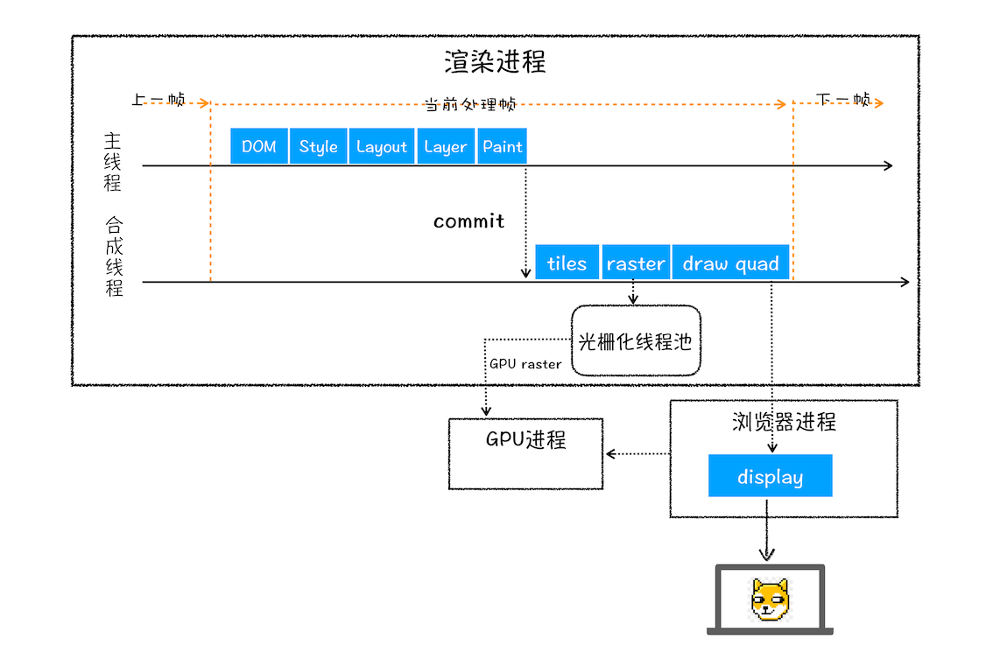
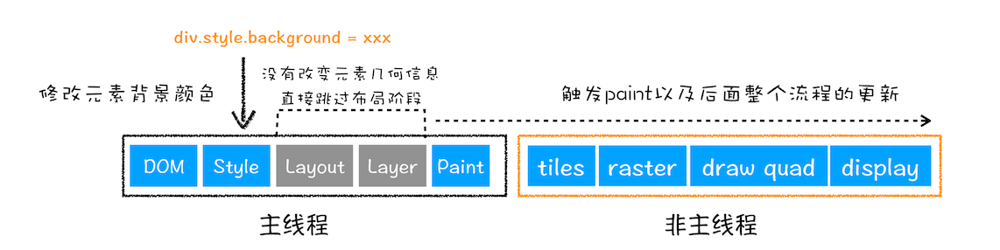
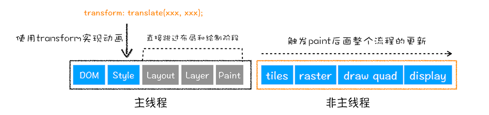

# 浏览器架构 (浏览器工作原理与实践-李兵)

## 单进程浏览器

**单进程浏览器是指浏览器的所有功能模块都是运行在同一个进程里**，这些模块包含了**网络**、**插件**、**JavaScript 运行环境**、**渲染引擎**和**页面**等。
**不稳定** 一崩则崩
**不流畅** 顺序执行，会阻塞
**不安全** 当运行一个插件，该插件可以完全操控 pc

## 多进程浏览器

进程隔离解决了不稳定，不同的渲染进程解决了不流畅，安全沙箱解决了不安全

### 现代多进程架构

- **浏览器进程**
  主要负责界面显示、用户交互、子进程管理，同时提供存储等功能
- **渲染进程**
  &emsp;核心任务是将 HTML、CSS 和 JavaScript 转换为用户可以与之交互的网页，排版引擎 Blink 和 JavaScript 引擎 V8 都是运行在该进程中，默认情况下，Chrome 会为每个 Tab 标签创建一个渲染进程。出于安全考虑，渲染进程都是运行在沙箱模式下。
- **GPU 进程**
  &emsp;其实，Chrome 刚开始发布的时候是没有 GPU 进程的。而 GPU 的使用初衷是为了实现 3D CSS 的效果，只是随后网页、Chrome 的 UI 界面都选择采用 GPU 来绘制，这使得 GPU 成为浏览器普遍的需求。最后，Chrome 在其多进程架构上也引入了 GPU 进程。
- **网络进程**
  &emsp;主要负责页面的网络资源加载，之前是作为一个模块运行在浏览器进程里面的，直至最近才独立出来，成为一个单独的进程。
- **插件进程**
  &emsp;主要是负责插件的运行，因插件易崩溃，所以需要通过插件进程来隔离，以保证插件进程崩溃不会对浏览器和页面造成影响。

**打开 1 个页面至少需要 1 个网络进程、1 个浏览器进程、1 个 GPU 进程以及 1 个渲染进程，共 4 个；如果打开的页面有运行插件的话，还需要再加上 1 个插件进程。**

### 未来面向服务的架构（Services Oriented Architecture，简称 SOA）

2016 年 Chrome 官方团队设计
&emsp; 原来的各种模块会被重构成独立的服务（Service），每个服务（Service）都可以在独立的进程中运行，访问服务（Service）必须使用定义好的接口，通过 IPC 来通信，从而构建一个更内聚、松耦合、易于维护和扩展的系统，更好实现 Chrome 简单、稳定、高速、安全的目标。
&emsp; Chrome 最终要把 UI、数据库、文件、设备、网络等模块重构为基础服务，类似操作系统底层服务

#从输入 URL 到页面展示，这中间发生了什么？ (浏览器工作原理与实践-李兵)

1. **用户输入**
   &emsp;当用户在地址栏中输入一个查询关键字时，地址栏会判断输入的关键字是搜索内容，还是请求的 URL。

- 如果是搜索内容，地址栏会使用浏览器默认的搜索引擎，来合成新的带搜索关键字的 URL。
- 如果判断输入内容符合 URL 规则，比如输入的是 time.geekbang.org，那么地址栏会根据规则，把这段内容加上协议，合成为完整的 URL，如 https://time.geekbang.org。
  &emsp;当用户输入关键字并键入回车之后，这意味着当前页面即将要被替换成新的页面，不过在这个流程继续之前，浏览器还给了当前页面一次执行 beforeunload 事件的机会，beforeunload 事件允许页面在退出之前执行一些数据清理操作，还可以询问用户是否要离开当前页面，比如当前页面可能有未提交完成的表单等情况，因此用户可以通过 beforeunload 事件来取消导航，让浏览器不再执行任何后续工作。
  当前页面没有监听 beforeunload 事件或者同意了继续后续流程，那么浏览器便进入下图的状态：
  

&emsp;从图中可以看出，当浏览器刚开始加载一个地址之后，标签页上的图标便进入了加载状态。但此时图中页面显示的依然是之前打开的页面内容，并没立即替换为极客时间的页面。因为需要等待提交文档阶段，页面内容才会被替换。 2. **URL 请求过程**
&emsp;首先，网络进程会查找**本地缓存**是否缓存了该资源。如果有缓存资源，那么直接返回资源给浏览器进程；如果在缓存中没有查找到资源，那么直接进入网络请求流程。这请求前的第一步是要进行**DNS**解析，以获取请求域名的服务器**IP**地址。如果请求协议是**HTTPS**，那么还需要建立**TLS**连接。
&emsp;接下来就是利用**IP**地址和服务器建立**TCP**连接。连接建立之后，浏览器端会构建**请求行**、**请求头**等信息，并把和该域名相关的**Cookie**等数据附加到请求头中，然后向服务器发送构建的请求信息。
&emsp;服务器接收到请求信息后，会根据请求信息生成响应数据（包括**响应行**、**响应头**和**响应体**等信息），并发给网络进程。等网络进程接收了响应行和响应头之后，就开始解析响应头的内容了。（为了方便讲述，下面我将服务器返回的响应头和响应行统称为响应头。）
&emsp;(1). **重定向**
&emsp;在接收到服务器返回的响应头后，网络进程开始解析响应头，如果发现返回的响应行中的状态码是**301**或者**302**，那么说明服务器需要浏览器重定向到其他 URL。这时网络进程会从响应头的**Location**字段里面读取重定向的地址，然后再发起新的 HTTP 或者 HTTPS 请求;如果响应行中的状态码是**200**，说明一切正常，那么表示浏览器可以继续处理该请求。
&emsp;(2). **响应数据类型处理**
&emsp;浏览器会根据响应头中的**Content-Type**字段的值来决定如何显示响应体的内容。**Content-Type** 决定了浏览器如何处理文件内容，如果是下载类型就提交给浏览器的下载器，导航流程结束；如果是 html 就需要准备渲染进程。 3. **准备渲染进程**
&emsp;通常情况下，打开新的页面都会使用单独的渲染进程。
&emsp;如果从 A 页面打开 B 页面，且 A 和 B 都属于同一站点的话，那么 B 页面复用 A 页面的渲染进程（_process-per-site-instance_）；如果是其他情况，浏览器进程则会为 B 创建一个新的渲染进程。 4. **提交文档**
&emsp;指浏览器进程将网络进程接收到的 HTML 数据提交给渲染进程，具体流程是这样的：

- 首先当浏览器进程接收到网络进程的响应头数据之后，便向渲染进程发起“提交文档”的消息；
- 渲染进程接收到“提交文档”的消息后，会和网络进程建立传输数据的“管道”；
- 等文档数据传输完成之后，渲染进程会返回“确认提交”的消息给浏览器进程；
- 浏览器进程在收到“确认提交”的消息后，会更新浏览器界面状态，包括了安全状态、地址栏的 URL、前进后退的历史状态，并更新 Web 页面。
  

5. **渲染阶段**

- **构建 DOM 树**
- **样式计算(Recalculate Style)**
  &emsp;1. 将 CSS 文本转换为浏览器可以理解的结构——styleSheets。
  &emsp;2. 转换样式表中的属性值，使其标准化
  
  &emsp;3. 计算出 DOM 树中每个节点的具体样式
- **布局阶段(layout)**
  &emsp;1. 创建布局树。布局树只包含可见元素
  
  &emsp;2. 布局计算
  &emsp;&emsp;（1）分层，并生成分层树。
  &emsp;&emsp;（2）为每个图层生成绘制列表，并将其提交到合成线程。
  &emsp;&emsp;（3）合成线程将图层分成图块(tile)，并在光栅化线程池中将图块转换成位图。
  &emsp;&emsp;（4）合成线程发送绘制图块命令 DrawQuad 给浏览器进程。
  &emsp;&emsp;（5）浏览器进程根据 DrawQuad 消息生成页面，并显示到显示器上。

注：以上渲染阶段统称为渲染流水线
# 重绘、重排、合成(浏览器工作原理与实践-李兵)
+ **（重排）更新了元素的几何属性**

如果通过 JavaScript 或者 CSS 修改元素的几何位置属性，例如改变元素的宽度、高度等，那么浏览器会触发重新布局，解析之后的一系列子阶段，这个过程就叫重排。**重排需要更新完整的渲染流水线，所以开销也是最大的**。
+ **（重绘）更新元素的绘制属性**

如果修改了元素的背景颜色，那么布局阶段将不会被执行，因为并没有引起几何位置的变换，所以就直接进入了绘制阶段，然后执行之后的一系列子阶段，这个过程就叫重绘。相较于重排操作，重绘省去了布局和分层阶段，所以**执行效率会比重排操作要高一些**。
+ **直接合成阶段**

在上图中，我们使用了 CSS 的 transform 来实现动画效果，这可以避开重排和重绘阶段，直接在非主线程上执行合成动画操作。这样的效率是最高的，因为是在非主线程上合成，并没有占用主线程的资源，另外也避开了布局和绘制两个子阶段，所以**相对于重绘和重排，合成能大大提升绘制效率**。
