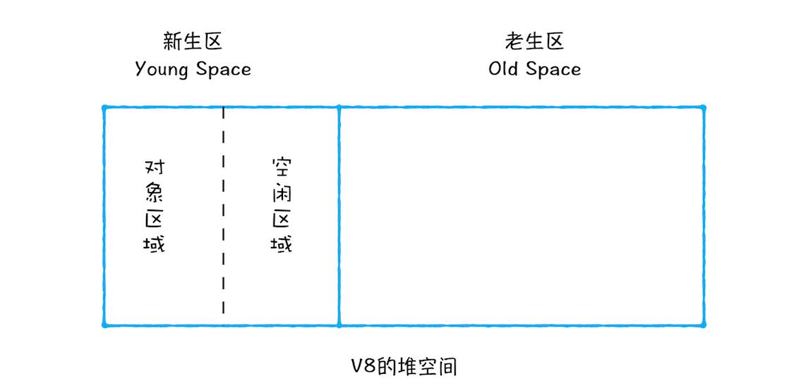
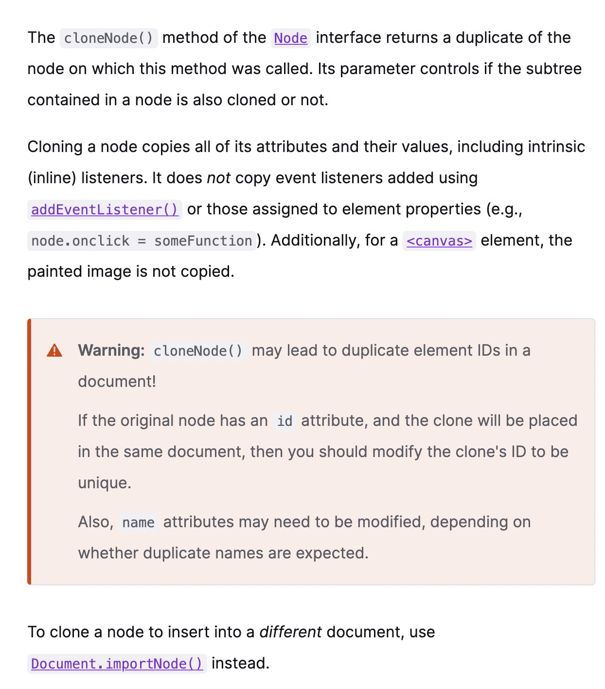

# 类型细节 <font size='2' color='#999'>（重学前端-程邵非）</font>

## 为什么有的编程规范要求用*void 0*，替代*undefined*（重学前端-程邵非）

&emsp;所有变量未赋值前都是 Undefined 类型，它的值是 undefined，但 undefined 是一个变量（不是关键字是，Javascript 设计上的失误），在局部作用域中可以被赋值，为了不在无意中被篡改，所以建议使用 void 0 把任意一个表达式变成 undefined 值。

```js
function a() {
  var undefined = 0;
  print(undefined);
}
a(); //0
```

<font size='2' color='#ff2200'>注： 全局作用域的 undefined 不能被赋值</font>

## null 类型

&emsp; null 类型只有一个值 null， null 是 javascript 的关键字，在任何代码中都可以用 null 来获取 null 值。

## String 类型

- 字符串的最大长度是 **2^53-1**
- 字符串构造出来后就不能被改变了。
- string 的实际意义其实是字符串的*UTF16*编码，字符串的操作*charAt*、_charCodeAt_、*length*等方法都是针对*UTF16*，javascript 把每个*UTF16*单元当作一个字符，BMP 以外的字符不适用。
  <font size='2' color='#ff2200'>注：UTF16 的*U+0000*-*U+FFFF*的码点值被称为 BMP(基本字符区域)</font>

## Number 类型

- 有效整数范围 -2^53+1 ~ 2^53-1
- 非整数的 Number 类型不能用==(===)来比较

```js
console.log(0.1 + 0.2 === 0.3); // false;
```

&emsp; 应该用

```js
console.log(Math.abs(0.1 + 0.2 - 0.3) <= Number.EPSILON); // true;
```

## Symbol 类型

### 全局的 Symbol 无法使用**new** 来调用

### API 接口

- **Symbol.iterator**对象的迭代行为定义

```js
var o = new Object();
o[Symbol.iterator] = function () {
  var v = 0;
  return {
    next: function () {
      return { value: v++, done: v > 10 };
    },
  };
};
for (var v of o) console.log(v); // 0 1 2 3 ... 9
```

- **Symbol.toPrimitive**覆盖对象转基本类型的行为

```js
var o = {
  valueOf: () => {
    console.log('valueOf');
    return {};
  },
  toString: () => {
    console.log('toString');
    return {};
  },
};
o[Symbol.toPrimitive] = () => {
  console.log('toPrimitive');
  return 'hello';
};
console.log(o + '');
// toPrimitive
// hello
```

## 类型转换

- 装箱

```js
var symbolObject = function () {
  return this;
}.call(Symbol('a'));
console.log(typeof symbolObject); //object
console.log(symbolObject instanceof Symbol); //true
console.log(symbolObject.constructor == Symbol); //true
```

```js
var symbolObject = Object(Symbol('a'));
console.log(typeof symbolObject); //object
console.log(symbolObject instanceof Symbol); //true
console.log(symbolObject.constructor == Symbol); //true
```

<font size='2' color='#ff2200'>每一类装箱对象皆有私有的 Class 属性，这些属性可以用 Object.prototype.toString 获取</font>

```js
var symbolObject = Object(Symbol('a'));
console.log(Object.prototype.toString.call(symbolObject)); //[object Symbol]
```

- 拆箱
  &emsp; 拆箱转换会尝试调用 valueOf 和 toString 来获得拆箱后的基本类型。如果 valueOf 和 toString 都不存在，或者没有返回基本类型，则会产生类型错误 TypeError。
  &emsp; Object 先调用 valueOf 后调用 toString，String 的拆箱是先调用 ToString 后调用 valueOf。

# 数组扁平化

## 1. es10 的新方法 Array.flat(depth)

```js
let a = [1, [2, 3]];
a.flat(); // [1,2,3]
a.flat(1); //[1,2,3]
```

```js
let a = [1, [2, 3, [4, [5]]]];
a.flat(4 - 1); // [1,2,3,4,5]  a是4维数组
```

```js
let a = [1, [2, 3, [4, [5]]]];
a.flat(Infinity); // [1,2,3,4,5]  a是4维数组
```

### 2. for 循环

```js
var arr1 = [1, 2, 3, [1, 2, 3, 4, [2, 3, 4]]];
function flatten(arr) {
  var res = [];
  for (let i = 0, length = arr.length; i < length; i++) {
    if (Array.isArray(arr[i])) {
      res = res.concat(flatten(arr[i])); //concat 并不会改变原数组
      //res.push(...flatten(arr[i])); //扩展运算符
    } else {
      res.push(arr[i]);
    }
  }
  return res;
}
flatten(arr1); //[1, 2, 3, 1, 2, 3, 4, 2, 3, 4]
```

### 3. while 循环

```js
var arr1 = [1, 2, [3], [1, 2, 3, [4, [2, 3, 4]]]];
function flatten(arr) {
  while (arr.some((item) => Array.isArray(item))) {
    arr = [].concat(...arr);
    //arr = Array.prototype.concat.apply([],arr);
  }
  return arr;
}
flatten(arr1); //[1, 2, 3, 1, 2, 3, 4, 2, 3, 4]
```

### 4. reduce 方法

```js
var arr1 = [1, 2, [3], [1, 2, 3, [4, [2, 3, 4]]]];
function flatten(arr) {
  return arr.reduce((res, next) => {
    return res.concat(Array.isArray(next) ? flatten(next) : next);
  }, []);
}
```

### 5. 使用 stack 无限反嵌套多层嵌套数组

```js
var arr1 = [1, 2, [3], [1, 2, 3, [4, [2, 3, 4]]]];
function flatten(input) {
  const stack = [...input]; //保证不会破坏原数组
  const result = [];
  while (stack.length) {
    const first = stack.shift();
    if (Array.isArray(first)) {
      stack.unshift(...first);
    } else {
      result.push(first);
    }
  }
  return result;
}
flatten(arr1); //[1, 2, 3, 1, 2, 3, 4, 2, 3, 4]
```

### 6. 如果数组的项全为数字，可以使用 join()，toString()

```js
function flatten(input) {
  return input
    .toString()
    .split(',')
    .map((item) => +item);
  // return input.join().split(',').map(item => +item);
  // return input.join(',').split(',').map(item => +item);
}
flatten(arr1); //[1, 2, 3, 1, 2, 3, 4, 2, 3, 4]
```

# 垃圾回收机制 <font size='2' color='#999'>(浏览器工作原理与实践-李兵)</font>

## 调用栈中数据的回收

当一个函数执行结束之后，JavaScript 引擎会通过向下移动 ESP 来销毁该函数保存在栈中的执行上下文。

## 堆中数据的回收

**代际假说**
特点：

- 第一个是大部分对象在内存中存在的时间很短，简单来说，就是很多对象一经分配内存，很快就变得不可访问。
- 第二个是不死的对象，会活得更久。

V8 会把堆分为**新生代**和**老生代**，新生代中存放的是生存时间短的对象，老生代中存放的是生存时间久的对象。
新生区通常只支持 1 ～ 8M 的容量，而老生区支持的容量就大很多了。
**副垃圾回收器，主要负责新生代的垃圾回收。**
**主垃圾回收器，主要负责老生代的垃圾回收。**

### 垃圾回收的执行流程

- 第一步是标记空间中活动对象和非活动对象。所谓活动对象就是还在使用的对象，非活动对象就是可以进行垃圾回收的对象。
- 第二步是回收非活动对象所占据的内存。其实就是在所有的标记完成之后，统一清理内存中所有被标记为可回收的对象。
- 第三步是做内存整理。一般来说，频繁回收对象后，内存中就会存在大量不连续空间，我们把这些不连续的内存空间称为**内存碎片**。当内存中出现了大量的内存碎片之后，如果需要分配较大连续内存的时候，就有可能出现内存不足的情况。所以最后一步需要整理这些内存碎片，但这步其实是可选的，因为有的垃圾回收器不会产生内存碎片，比如接下来我们要介绍的副垃圾回收器。

### 副垃圾回收器

&emsp; 而通常情况下，大多数小的对象都会被分配到新生区，所以说这个区域虽然不大，但是垃圾回收还是比较频繁的。
&emsp; 新生代中用 Scavenge 算法来处理。所谓 Scavenge 算法，是把新生代空间对半划分为两个区域，一半是对象区域，一半是空闲区域，如下图所示。

&emsp; 新加入的对象都会存放到对象区域，当对象区域快被写满时，就需要执行一次垃圾清理操作。
&emsp; 在垃圾回收过程中，首先要对对象区域中的垃圾做标记；标记完成之后，就进入垃圾清理阶段，副垃圾回收器会把这些存活的对象复制到空闲区域中，同时它还会把这些对象有序地排列起来，所以这个复制过程，也就相当于完成了内存整理操作，复制后空闲区域就没有内存碎片了。
&emsp; 完成复制后，对象区域与空闲区域进行角色翻转，也就是原来的对象区域变成空闲区域，原来的空闲区域变成了对象区域。这样就完成了垃圾对象的回收操作，同时这种**角色翻转的操作还能让新生代中的这两块区域无限重复使用下去。**
&emsp; 由于新生代中采用的 Scavenge 算法，所以每次执行清理操作时，都需要将存活的对象从对象区域复制到空闲区域。但复制操作需要时间成本，如果新生区空间设置得太大了，那么每次清理的时间就会过久，所以**为了执行效率，一般新生区的空间会被设置得比较小**。
&emsp; 也正是因为新生区的空间不大，所以很容易被存活的对象装满整个区域。为了解决这个问题，JavaScript 引擎采用了**对象晋升策略**，也就是经过两次垃圾回收依然还存活的对象，会被移动到老生区中。

### 主垃圾回收器

&emsp; 主垃圾回收器是采用 **标记 - 清除**（Mark-Sweep）的算法进行垃圾回收的
首先是标记过程阶段。标记阶段就是从一组根元素开始，递归遍历这组根元素，在这个遍历过程中，能到达的元素称为**活动对象**，没有到达的元素就可以判断为**垃圾数据**。
标记-消除有内存碎片，于是产生了**标记 - 整理**

### 全停顿

&emsp; 待垃圾回收完毕后再恢复脚本执行。我们把这种行为叫做全停顿（Stop-The-World）。
&emsp; 为了降低老生代的垃圾回收而造成的卡顿，V8 将标记过程分为一个个的子标记过程，同时让垃圾回收标记和 JavaScript 应用逻辑交替进行，直到标记阶段完成，我们把这个算法称为**增量标记（Incremental Marking）算法**。

# DOM

## Node 类型

### 节点类型

- `Node.ELEMENT_NODE(1)` // `<p>` `<div>`
- `Node.ATTRIBUTE_NODE(2)` // `<p name> ==> name` (DOM4 弃用)
- `Node.TEXT_NODE(3)` // `<p>abc</p> ==> abc`
- `Node.CDATA_SECTION_NODE(4)` // `<!CDATA[[ … ]]>`
- `Node.PROCESSING_INSTRUCTION_NODE(7)` // `<?xml-stylesheet … ?>`
- `Node.COMMENT_NODE(8)` // `<!-- … -->`
- `Node.DOCUMENT_NODE(9)`
- `Node.DOCUMENT_TYPE_NODE(10)` // `<!DOCTYPE html>`
- `Node.DOCUMENT_FRAGMENT_NODE(11)`
  _5 6 12 已经弃用_

### 节点关系

- 节点名 `.nodeName`
- 节点值 `.nodeValue`
- 节点访问 ` node.childNodes[0] === node.childNodes.item(0)`
- 节点个数 `let count = node.childNodes.length;`
- 平级 `.nextSibling` `.previousSibling`
- 子级 `.firstChild` `.lastChild`
- 父级 `.parentNode`
- 是否有子节点 `.hasChildNodes()`

### 操纵节点

**以下都要在父节点调用，如果不支持子节点则抛错**

- 在结尾加子节点(返回该子节点) `.appendChild(newNode) // newNode`
  _由于一个节点不会在文档同时出现两次以上，所以有如下性质_
  _即：如果把已经存在的节点传给`appendChild`方法，这个节点会从之前的位置转移到新位置。_
- 把节点放到特定位置 `.insertBefore(newNode, pos)`
  _.insertBefore(newNode, null) === .appendChild(newNode)_
- 节点替换 `.replaceChild(newNode, someNode)`
  _someNode 节点会从文档树中完全移除，被 newNode 取尔代之。_
- 移除节点(返回移除的节点) `.removeChild(someNode) //someNode`

### 其它方法

- （所有节点类型共享）克隆一个与调用它的节点一模一样的节点`someNode.cloneNode(boolean?) //someNode`
  _boolean 为 true 时表是深复制（即复制节点及整个子 DOM 树），false 只会复制调用该方法的节点。_
  _复制返回的节点属于文档所有，但未指定父节点（孤儿节点**orphan**），可以用`appendChild insertBefore replaceChild`等方法插入文档树。_
  _其它注意：_

  

- `.normalize()`
  _检测调用节点的所有后代，如果发现空文本节点就删除；如果两个文本节点是同胞节点且相邻，则将其合并为一个文本节点。_

```js
let wrapper = document.createElement('div');

wrapper.appendChild(document.createTextNode('Part 1 '));
wrapper.appendChild(document.createTextNode('Part 2 '));

let node = wrapper.firstChild;
let result = 'Before normalization:<br/>';
while (node) {
  result += ' ' + node.nodeName + ': ' + node.nodeValue + '<br/>';
  node = node.nextSibling;
}

wrapper.normalize();

node = wrapper.firstChild;
result += '<br/><br/>After normalization:<br/>';
while (node) {
  result += ' ' + node.nodeName + ': ' + node.nodeValue + '<br/>';
  node = node.nextSibling;
}

const output = document.getElementById('result');
output.innerHTML = result;
// Before normalization:
// #text: Part 1
// #text: Part 2

// After normalization:
// #text: Part 1 Part 2
```

## Document 类型

**`Document`类型是 JavaScript 中表示文档节点的类型**
**文档对象`document`是`HTMLDocument`的实例（HTMLDocument 继承自 Document），表示整个 HTML 页面**
**document 是 window 对象的属性，是全局属性**

### 特征

- `.nodeType === 9`
- `.nodeName === "#document"`
- `.nodeValue === null`
- `.parentNode === null`
- `.ownerDocument === null`
- 子节点可以是`DocumentType`(最多一个)、`Element`(最多一个)、`ProcessingInstruction`或`Comment`

### 文档子节点

- `document.documentElement` 始终指向 HTML 页面中的`<html>`元素。
  _document.documentElement ===
  document.childNodes[0] ===
  document.firstChild_
- `document.body` 始终指向`<body>`
- `document.doctype` 访问<!doctype>标签
  <font size='2' color='#ff2200'>注: 节点操作的方法不可用（文档类型是只读的）</font>

### 文档信息

- `document.title` `document.title = name`
  _浏览器标题栏信息，可读可改，改后立即反映到浏览器_
- `document.URL` 取得完整*URL*（只读）
- `document.domain` 取得域名 \*可写，但只能写 URL 中包含的值。**写短了以后就不能再写长！！\***
  _改写可用于解决`<iframe>`跨域通信的问题_

  ```js
  let domain = document.domain; //www.wrox.com
  document.domain = 'wrox.com'; // success
  document.domain = 'nczonline.net'; // failed

  document.domain = 'wrox.com'; // success
  document.domain = 'www.wrox.com'; // error
  ```

- `document.referrer` 链接到当前页面的*URL*，如果没有是`''`（只读）
  <font size='2' color='#ff2200'>注：URL domain referrer 都是从请求头中读取的</font>

### 定位元素

- `document.getElementById(IdName:string):HTMLElement | null`
  IdName 要与元素在页面中的 id 名完全匹配，如果有多个相同 id，则返回第一个\*
- `document.getElementsByTagName(tagName:string):HTMLCollection`
  _HTMLCollection 和 NodeList 有一样的获取元素的方法和取得数量的方法_
  _返回的 HTMLCollection 对象保存在 images 中，`images.namedItem('a')`可以得到 name 名的 a 的标签的引用_
- `document.getElementsByName(name:string):HTMLCollection`

### 特殊集合

- `document.anchors` 文档中所有带 name 属性的`<a>`元素
- `document.forms` === `document.getElementsByTagName('forms')`
- `document.images` === `document.getElementsByTagName('img')`
- `document.links` 文档中所有带 href 属性的`<a>`元素

### 文档写入

- `document.write()` `document.writeln()`
  _如果加载完页面后调用，则会重写整个页面。_
- `document.open()` `document.close()`
  <font size='2' color='#ff2200'>注：调用 open 方法，
  &emsp; 已注册到文档、文档中的节点或文档的 window 的所有事件监听器会被清除。
  &emsp; 文档中的所有节点会被清除。
  write()在页面加载后调用，会发生自动调用 open()</font>

## Element 类型

**可以通过`nodeName`或`tagName`属性获取元素的标签名**

```js
let div = document.getElementById('myDiv');
alert(div.tagName); // "DIV"
div.tagName === div.nodeName; // "true"
```

**在 HTML 中,元素标签名始终以全大写表示，在 XML(包括 XHTML)中，标签名始终与源代码中的大小写一致，故比较时最好将标签名转换为小写形式**

### 特征

- `.nodeType === 1`
- `.nodeName` 值为元素的标签名 如：'DIV'
- `.nodeValue === null`
- `.parentNode` 值为 Document ｜ Element 对象
- 子节点可以是`Element`、`Text`、`Comment`、`ProcessingInstruction`、`CDATASection`类型

### HTML 元素

所有 HTML 元素都通过 HTMLElement 类型表示，标准属性

- id
- title // 包含元素的额外信息，通常以提示条形式展示
- lang // 元素内容的语言代码(很少用) 如 'en','zh'等
- dir // 语言的书写方向（ltr， rtl, 很少用）
- className
  <font size='2' color='#ff2200'>注：以上都可以修改</font>

### 取得属性

- `div.getAttribute(attribute:string): string | null`
  _属性名不区分大小写_
  _主要用于取得自定义属性的值_
- `div.setAttribute(attribute:string, value:string)`

### attributes 属性

**Element 类型是唯一使用 attributes 属性的 DOM 节点类型**
**attributes 属性包含一个 NamedNodeMap 实例，是一个类似 NodeList 的“实时”集合。**
**元素的每个属性都表示为一个 Attr 节点，并保存在这个 NameNodeMap 对象中**
**NameNodeMap 对象包含以下方法**

- getNamedItem(name)
- removeNamedItem(name)
- setNamedItem(node)
- item()

```js
let id = element.attributes.getNamedItem('Id').nodeValue;
let id = element.attributes['Id'].nodeValue;
element.attributes['id'].nodeValue = 'someOtherId';
let oldAttr = element.attributes.removeNamedItem('Id');
```

### 创建元素

`document.createElement(tagName: string)`;

### 元素后代

可以在元素节点调用`getElementByTagName()`方法，搜索范围限制在当前元素之内，只会返回当前元素的后代。

```html
<ul id="myList">
  <li>Item 1</li>
  <li>Item 2</li>
  <li>Item 3</li>
</ul>
```

```js
let ul = document.getElementById('myList');
let items = ul.getElementByTagName('li');
```

<font size='2' color='#ff2200'>注：如果 ul 包含更多层级，则所有层级中的`<li>`元素都会返回。</font>

## TEXT 类型

### 特征

- `nodeType === 3`
- `nodeName === '#text'`
- `nodeValue` 值为节点中包含的文本
- `parentNode` 值为 Element 对象
- 不支持子节点

### 属性

- `nodeValue` === `data`
  nodeValue, data 都有 length 属性

### 方法

- `appendData(text)` 向节点末尾添加文本 text
- `deleteData(offset, count)` 从位置 offset 开始删除 count 个字符
- `insertData(offset, text)`
- `replaceData(offset, count, text)` 用 text 替换从位置 offset 到 offset+count 的文本
- `splitText(offset)`
- `substringData(offset, count)`
- `document.createTextNode(str:string)` 创建 text 节点

## Commit 类型

### 特征

- `nodeType === 8`
- `nodeName === #comment`
- `nodeValue` 值为注释的内容
- `parentNode`值为 Document 或 Element 对象
- 不支持子节点

### 方法

comment 类型与 Text 类型继承同一个基类**CharacterData**，所以拥有除 splitText 外 Text 节点所有的操作方法

- `document.createComment(content:string)`

## CDATASection 类型

**CDATA**区块只在 XML 文档中有效

### 特征

- `nodeType === 4`
- `nodeName === '#cdata-section'`
- `nodeValue` 值为 CDATA 区块的内容
- `parentNode` 值为 Document 或 Element 对象
- `不支持子节点`

### 方法

CDATASection 继承自 Text，拥有 text 所有的操作方法
xml 文档中可以使用 `document。createCDataSection()` 创建

## DocumentType 类型

DocumentType 类型的节点包含文档的文档类型（doctype）信息

### 特征

- `nodeType === 10`
- `nodeName` 值为文档类型的名称
- `nodeValue === null`
- `parentNode` 值为 Document 对象
- `不支持子节点`

## DocumentFragment 类型

这是唯一一个在标记中没有对应表示的类型 该类型表示轻量级文档

### 特征

- `nodeType === 11`
- `nodeName === '#document-fragment'`
- `nodeValue === null`
- `parentNode === null`
- 子节点可以是`Element`、`ProcessingInstruction`、`Comment`、`Text`、`CDATASection`或`EntityReference`

## <a href='https://developer.mozilla.org/zh-CN/docs/Web/API/MutationObserver'> mutationObserver 接口</a>

- 用于监控 dom 变化

## DOM 扩展

### 方法

- `document.querySelector(params:string):htmlDocument | null`
  params 是 css 选择符参数
- `document.querySelectorAll(params:string): htmlDocument[] | null`
- `element.matches(params:string) // true | false`
  用于检测某个元素会不会被上面两个方法返回

### 元素遍历

IE9 之前的版本不会把元素间的空格当成空白节点，而其它浏览器则会，所以为了弥补差异，新增**element traversal API**

- `childElementCount`
- `firstElementChild`
- `lastElementChild`
- `previousElementSibling`
- `nextElementSibling`
  <font size='2' color='#ff2200'>注：以上只包含 element 节点</font>

## HTML 5

### css 类扩展

- `document.getElementsByClassName(name:string)`
  IE9 以上，及现代浏览器都支持

- `element.classList` （可迭代）
  IE10 以上，及现代浏览器都支持
  - `element.classList.remove(class:string)`
  - `element.classList.add(class:string)`
  - `element.classList.toggle(class:string)` // 切换，存在就删除，不存在就添加
  - `element.classList.contains(class:string)` // 检测类名

### 焦点管理

- `document.activeElement` 获得 focus 的元素
  页面刚加载完后会设置为 document.body, 完全加载后设置为 null
- `document.hasFocus()` 文档是否拥有焦点

### HTMLDocument 扩展

- `document.readyState // loading, complete` 用来判断文档是否加元完毕
- `document.compatMode // CSS1Compat BackCompat` 标准模式和混杂模式
  用来指示浏览器当前处于什么渲染模式
- `document.head` 指向`<head>`元素。

### 字符集属性

- `document.characterSet` 文档实际使用的字符集（可负值）

### 自定义属性

- `data-` 前缀

```js
<div id="myDiv" data-appId="12345" data-myname="Nicholas"></div>;

let div = document.getElementById('myDiv');
let appId = div.dataset.appId;
```

### 插入标记

- `innerHTML` 会返回元素所有后代的 HTML 字符串
  现代浏览器中，通过 innerHTML 插入的`<script>`标签是不会执行的。
- `outerHTML` 返回调用它的元素的和所有后代的 HTML 字符串
- `element.insertAdjacentHTML(pos:IPos, htmlStr)`
- `element.insertAdjacentText(pos:IPos, htmlStr)`

```ts
type IPos = 'beforebegin' | 'afterbegin' | 'beforeend' | 'afterend';
```

<font size='2' color='#ff2200'>注：innerHTML 虽然不会执行自己创建的\<script>标签，但可以毫不费力的创建元素并执行 onclick 之类的属性。</font>

## 专有扩展

- `element.children` 只包含元素类型
- `element.contains(children) //true or false` 判断一个元素是不是另一个元素的后代
- `innerText`
- `outerText`
  按照 dfs 将子树中所有广西节点的值拼接起来。outerText 包括自己。
